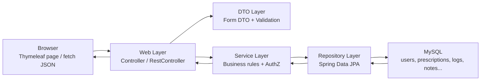
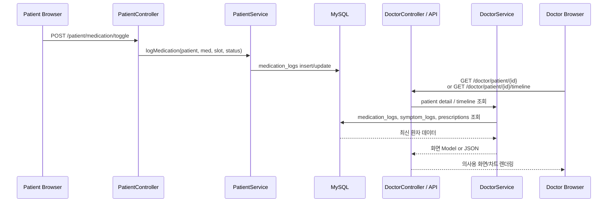

# Clarix Backend Architecture

작성일: 2026-05-28

## 1. 백엔드 개요

Clarix는 Spring Boot MVC 기반의 서버 렌더링 웹 애플리케이션이다. 환자, 의사, 간호/기술직, 접수 직원, 관리자가 같은 Spring Boot 애플리케이션에 로그인하지만, URL 권한과 서비스 계층 권한 검사를 통해 각 역할별 화면과 기능을 분리한다.

프론트엔드는 Thymeleaf 템플릿으로 렌더링하고, 백엔드는 Spring MVC Controller, Service, Spring Data JPA Repository, JPA Entity, DTO 계층으로 구성한다. 데이터는 MySQL에 저장되며, Hibernate/JPA가 Entity와 테이블을 매핑한다.

## 2. 기술 스택

| 영역 | 사용 기술 | 실제 위치 |
|---|---|---|
| Backend Framework | Spring Boot 3.5, Spring MVC | `patient-api/src/main/java/com/clarix` |
| Security | Spring Security 세션 로그인, BCrypt | `config/SecurityConfig.java`, `service/CustomUserDetailsService.java` |
| View | Thymeleaf | `src/main/resources/templates` |
| Database | MySQL 8, Hibernate JPA | `src/main/resources/application.properties` |
| ORM | Spring Data JPA Repository | `repo/*Repository.java` |
| Validation | Jakarta Bean Validation DTO | `dto/*Form.java` |
| JSON API | `@RestController` + Jackson | `web/DoctorApiController.java`, `web/HealthController.java` |
| AI 연동 | Gemini REST 호출 | `service/GeminiSoapService.java` |

## 3. 패키지별 역할

| 패키지 | 역할 |
|---|---|
| `domain` | MySQL 테이블과 매핑되는 JPA Entity, Enum. 예: `User`, `Prescription`, `MedicationLog`, `SymptomLog`, `ClinicalNote`, `CareRequest` |
| `repo` | Spring Data JPA Repository. Entity CRUD와 조건 조회 담당 |
| `dto` | 화면 Form 입력값을 받는 DTO. `@Valid` 검증과 메시지 처리 |
| `service` | 핵심 업무 규칙, 트랜잭션, 권한 검사, 여러 Repository 조합 |
| `web` | URL 라우팅, 세션 사용자 확인, 화면 Model 구성, redirect 처리 |
| `config` | 보안 설정, 데모 데이터 초기화, 외부 설정 |

이 구조는 일반적인 Layered Architecture이다. Controller가 직접 DB를 조작하지 않고 Service를 호출하며, Repository 접근은 Service 계층에 모아 둔다.

## 4. 주요 도메인 모델

| Entity | 설명 |
|---|---|
| `User` | 사용자 공통 테이블. 환자, 의사, 직원, 관리자 역할을 `Role`로 구분 |
| `Hospital` | 병원 정보 |
| `Permission` | 환자와 의사의 공유 권한. 의사는 활성 권한이 있는 환자만 조회 가능 |
| `Prescription` | 환자의 처방약, 복약 시간대, 처방 일수 |
| `MedicationLog` | 환자의 복약 기록 |
| `SymptomLog` | 환자의 감정/증상/일기 기록 |
| `Assessment` | PHQ-9 자가검사 결과 |
| `ClinicalNote` | 의사/간호/기술직 차팅 기록 |
| `CareRequest` | 환자가 병원에 보내는 진료 요청 |
| `StaffInvite` | 의사가 사무/의료직원을 초대하고 활성/비활성 관리 |

## 5. 인증과 인가

인증은 Spring Security Form Login을 사용한다. 로그인 성공 후 `Role`에 따라 시작 화면이 달라진다.

| Role | URL Prefix | 주요 기능 |
|---|---|---|
| `PATIENT` | `/patient/**` | 복약, 감정, 식사, 운동, 진료 요청, 공유 권한 관리 |
| `DOCTOR` | `/doctor/**` | 환자 대시보드, 환자 상세, SOAP 차팅, 처방, 직원 초대 |
| `RECEPTIONIST` | `/reception/**` | 진료 요청 확인, 예약 일정 입력, 환자 연락 메모 |
| `NURSE`, `TECHNICIAN` | `/staff/**` | 같은 병원 환자 차팅 |
| `ADMIN` | `/admin/**` | 병원/사용자 관리 |

URL 접근은 `SecurityConfig`에서 1차로 차단한다. 민감한 데이터 접근은 Service 계층에서 다시 검사한다. 예를 들어 의사는 URL의 환자 ID를 임의로 바꾸더라도 `DoctorService.requireSharedPatient()`를 통과하지 못하면 환자 상세를 볼 수 없다.

## 6. 주요 기능 흐름

### 6.1 환자 복약 입력 -> 의사 조회

### 6.2 환자 감정 기록 -> 의사 대시보드 반영

환자가 감정과 일기를 저장하면 `SymptomLog`에 저장된다. 의사 대시보드는 `DoctorService.patientsForDoctor()`에서 최근 감정, 평균 기분, PHQ-9, 복약률을 조합해 환자 위험도를 계산한다.

### 6.3 환자 진료 요청 -> 접수 직원 확인

환자는 복약 화면에서 중간 진료 요청을 보낼 수 있다. 요청은 `CareRequest`로 저장된다. 접수 직원 화면은 같은 병원의 `PENDING` 요청을 조회하고, 처리 완료 시 `SCHEDULED` 상태로 변경한다.

### 6.4 접수 예약 입력 -> 환자 화면/캘린더 표시

접수 직원이 환자별 진료 일시를 입력하면 `User.bookedAt`에 저장된다. 환자는 Today, 마이페이지, 캘린더에서 다음 진료 일정을 확인한다. 시간 표시는 `Asia/Seoul` 기준으로 통일한다.

## 7. CRUD 구현 현황

| 기능 | Create | Read | Update | Delete/Deactivate |
|---|---:|---:|---:|---:|
| 환자 복약 기록 | O | O | O | 오늘 기록 초기화는 테스트용 |
| 감정/증상 기록 | O | O | O | O |
| 처방 | O | O | O | 비활성화 |
| SOAP/차팅 | O | O | O | O |
| 진료 요청 | O | O | 상태 변경 | 환자 취소 |
| 직원 초대 | O | O | 활성/비활성 | 비활성화 |
| 병원/사용자 관리 | O | O | O | 일부 토글 |

## 8. REST API / JSON 처리

대부분 화면은 Thymeleaf MVC로 렌더링하지만, 일부 기능은 JSON API를 사용한다.

| API | 설명 |
|---|---|
| `GET /doctor/patient/{id}/timeline` | 환자 복약/기분 타임라인을 JSON으로 반환 |
| `POST /doctor/drug-check` | 처방 추가 전 약물 상호작용 위험을 JSON으로 반환 |
| `POST /doctor/patient/{id}/llm-soap` | 자유 텍스트를 Gemini로 SOAP JSON 초안으로 변환 |
| `GET /health` | 배포/서버 상태 확인 |

## 9. 두 창에서 데이터가 바로 보이는가?

결론부터 말하면, 같은 MySQL을 사용하므로 환자 창에서 입력한 데이터는 DB에 저장된 직후 의사용 화면에서 조회할 수 있다. 다만 현재 구조는 WebSocket, Server-Sent Events, polling이 없는 서버 렌더링 구조이므로, 이미 열려 있는 의사 화면이 자동으로 실시간 갱신되지는 않는다.

즉 동작 기준은 다음과 같다.

| 상황 | 가능 여부 | 설명 |
|---|---:|---|
| 환자 입력 후 의사가 환자 상세 페이지를 새로 열기 | O | 최신 MySQL 데이터를 조회하므로 바로 보임 |
| 환자 입력 후 의사가 기존 환자 상세 페이지를 새로고침 | O | 새 요청에서 DB를 다시 읽음 |
| 환자 입력 후 의사 페이지의 타임라인 JSON을 다시 호출 | O | `DoctorApiController`가 최신 DB 데이터를 반환 |
| 환자 입력 순간 의사 화면이 자동으로 바뀜 | X | 현재 WebSocket/SSE/polling 미구현 |

발표 데모에서는 두 창을 띄운 뒤 다음 순서로 보여주면 된다.

1. 의사 창에서 환자 상세 또는 환자 목록을 열어 둔다.
2. 환자 창에서 복약/감정/진료 요청을 입력한다.
3. 의사 창을 새로고침하거나 환자 상세로 다시 들어간다.
4. 의사 화면에서 복약률, 최근 감정, 타임라인, 진료 요청 관련 데이터가 반영된 것을 확인한다.

완전한 실시간 동기화를 보여주려면 추후 WebSocket 또는 일정 주기의 fetch polling을 추가해야 한다.

## 10. 설계상 장점

- 역할별 URL과 화면이 분리되어 발표 데모 흐름이 명확하다.
- Controller, Service, Repository가 분리되어 백엔드 계층 설명이 쉽다.
- DTO 기반 검증으로 입력값 오류를 화면에 피드백할 수 있다.
- MySQL 기반 CRUD가 여러 도메인에 걸쳐 구현되어 있다.
- REST/JSON API와 Thymeleaf MVC를 함께 사용해 과제 조건을 충족한다.
- 환자 입력 데이터가 의사/접수 화면에서 같은 DB를 통해 연결되어 기획과 구현의 연결성을 설명하기 좋다.

## 11. 현재 한계와 개선 가능성

- 의사 화면 자동 실시간 갱신은 아직 없다.
- `spring.jpa.hibernate.ddl-auto=update`는 데모 개발에는 편하지만, 운영 단계에서는 Flyway/Liquibase로 교체하는 것이 좋다.
- 일부 통계 계산은 발표용 단순 집계이며, 실제 의료 서비스라면 임상 기준과 감사 로그가 더 필요하다.
- Gemini SOAP는 API Key가 없으면 명확히 실패하도록 되어 있으며, 실제 AI 생성 품질은 외부 API 설정에 의존한다.
